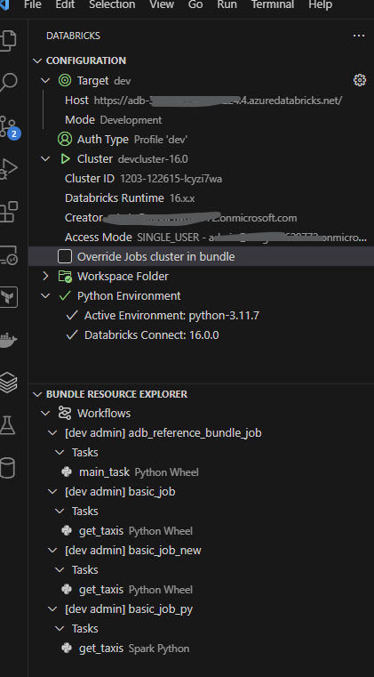
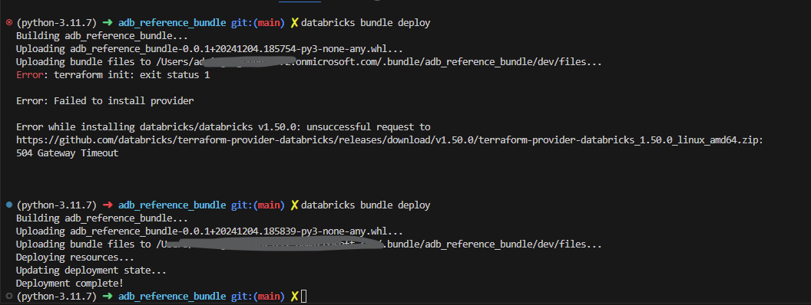

# Overview

This repo provides a simple set of Azure Databricks examples that leverages:

1. Databricks Bundles for Jobs
1. Using External Managed Storage for a Databricks Catalog
1. Terraform for creating a the required External Locations, Catalog, Schemas, and Table
1. Example of Tests that are run via the `launch.json` capability of Visual Studio Code
1. Use of Python Packages for Wheel (`.whl`) creation for jobs
1. Jobs that run a Python Wheel or Python Script
1. Compatability with the Databricks Visual Studio Code add in
1. Compatability and reliance on the Databricks CLI

Unity Catalog provides a central discovery and resolution for credentials, external locations, and other governance services. It should be an important part of any well managed product or service.


> [!IMPORTANT]  
>> This simple walkthrough assumes that a Azure Databricks Unity Catalog Metastore exists in the Azure Region that all work will be done.
>> Assumptions: ADB Workspace exists AND it is tied to a Regional Unity Catalog Metastore


## Environment Setup

After you clone the repo there are a set of steps required to get up and running.


### Tools
First the following set of tools are used.

- [Visual Studio Code - start with the Python Profile](https://code.visualstudio.com)
- [Databricks Extension for VS Code](https://docs.databricks.com/dev-tools/vscode-ext.html)
- [Taskfile.dev](https://taskfile.dev/installation/#binary)
- [Azure CLI](https://docs.microsoft.com/en-us/cli/azure/install-azure-cli)
- [Databricks CLI](https://docs.databricks.com/dev-tools/cli/index.html)
- [Python 3.11 - with pyenv (my favorite)](https://realpython.com/intro-to-pyenv/#installing-python-versions-with-pyenv)
- [Python 3.11 - alternative path with uv from Astral](https://docs.astral.sh/uv/guides/install-python/)
- [Terraform v1.10](https://learn.hashicorp.com/tutorials/terraform/install-cli)
- [direnv - not required but useful](https://direnv.net/docs/installation.html) 


> [!TIP]
> The repo contains example `.envrc` files which are used by `direnv` tool to automatically add `ENV` variables to the local shell environments. In addition, it can automtically create Python Virtualenvs. Explore more at [direnv.net](https://direnv.net)

## Configuration

After you setup the tools a few steps are needed to get the full experience.

### Copy or Rename all the `*.example` files as needed.

There are files in the following paths that should be reviewed initially.

```shell
-- resources/jobs
-- resources/targets
-- resources/variables
```


> [!TIP]
> The convention used in this repo is to help decouple various environment specific settings such as host names, cluster IDs etc. that are generally embedded in the `databricks.yml` file. There may be other ways to decouple however, I found this is easiest at this point. For example for `target/jobs/host` names, there is no way to provide a variable or substiution in the files. So, simple `includes` is a method.  

> [!WARNING]
> from the Databricks documention [Databricks Asset Bundle configuration- Other workspace mappings](https://docs.databricks.com/en/dev-tools/bundles/settings.html#other-workspace-mappings)
>> You must hard-code values for the following workspace mappings for Databricks authentication. For instance, you cannot specify custom variables for these mappings’ values by using the `${var.*}` syntax.


#### File: `.envrc.example`

This is optional. This would be copied to `.envrc` and then with the `direnv` tool added to your shell, would faciliated isolation of configuration settings for Azure CLI, Databricks configuration location, and a Python Virtual Environment as needed.

#### Files: `resources/jobs/`

For this file, there is nothing needed except to review and understand the example methods of setting up jobs. There are basic script and wheel examples. In addition, the job created by using the `databricks init` command for an example Python workflow is also included.

#### Files: `resources/targets/`

Follow the `TODO` comments to replace the Databricks Host name for your workspace along with the Username. 

```yaml
# rename or copy this file to prod_target.yml or dev_target.yml
# update the host to the production workspace URL
# update the root_path to a unique path for the production target
# update the user_name to the production user
# run "databricks auth describe" perhaps to get your user_name and host
```

#### Files: `resources/variables/`

Here you need a cluster ID -- so you can use `databricks cluster list` (after you've done steps to login to Azure and then Databricks configure) to see the cluster ID's available for your workspace.

```yaml
variables:
  dev_cluster_id:
    default: 1203-122615-lcyzi7wa
```

### Azure CLI Login

Personally, I prefer for my local developer experience to rely on the Azure CLI.

### Databricks Configure

Review the [Databricks CLI](https://learn.microsoft.com/en-us/azure/databricks/dev-tools/auth/) authentication options.  

> [!TIP]
> Strongly recommend that the [Azure CLI](https://learn.microsoft.com/en-us/azure/databricks/dev-tools/auth/azure-cli) method is used as it minimizes secret and token management.

## Running Jobs

At this point your enviroment should be ready. 

### Validate

#### Databricks VS Code Extension

For the Databricks VS Code extension, you should be able to see the Configuration and Bundle Resources.



#### Databricks CLI

From the shell you should be able to execte commands like `databricks auth describe` view various session and context information.

### Deploy the Bundle

From the shell (open a terminal in VS code) you can run `databricks bundle deploy` as an example.


```shell
databricks bundle deploy -t dev
```

> [!CAUTION]
> There are oddities with the combination of the Databricks VS Code add in and the CLI -- so, you might have to [destroy the bundle](#destroy-the-bundle) before running or deployment...

### Run a job

```shell
databricks bundle run basic_job_py -t dev
```

### Destroy the Bundle

```shell
databricks bundle destroy -t dev    

```

> [!TIP]
> In the following you see that it first fails -- this is because Databricks internally relies on Terraform and for this error it was intermittent -- as shown by the `504 Gateway Timeout` -- so I just ran it again.




Run a job with 

# Background information

The following was auto-generated from the `databricks init` tool.

## adb_reference_bundle

The 'adb_reference_bundle' project was generated by using the default-python template.

## Getting started

1. Install the Databricks CLI from https://docs.databricks.com/dev-tools/cli/databricks-cli.html

2. Authenticate to your Databricks workspace, if you have not done so already:
    ```
    $ databricks configure
    ```

3. To deploy a development copy of this project, type:
    ```
    $ databricks bundle deploy --target dev
    ```
    (Note that "dev" is the default target, so the `--target` parameter
    is optional here.)

    This deploys everything that's defined for this project.
    For example, the default template would deploy a job called
    `[dev yourname] adb_reference_bundle_job` to your workspace.
    You can find that job by opening your workpace and clicking on **Workflows**.

4. Similarly, to deploy a production copy, type:
   ```
   $ databricks bundle deploy --target prod
   ```

   Note that the default job from the template has a schedule that runs every day
   (defined in resources/adb_reference_bundle_job.yml). The schedule
   is paused when deploying in development mode (see
   https://docs.databricks.com/dev-tools/bundles/deployment-modes.html).

5. To run a job or pipeline, use the "run" command:
   ```
   $ databricks bundle run
   ```

6. Optionally, install developer tools such as the Databricks extension for Visual Studio Code from
   https://docs.databricks.com/dev-tools/vscode-ext.html. Or read the "getting started" documentation for
   **Databricks Connect** for instructions on running the included Python code from a different IDE.

7. For documentation on the Databricks asset bundles format used
   for this project, and for CI/CD configuration, see
   https://docs.databricks.com/dev-tools/bundles/index.html.
