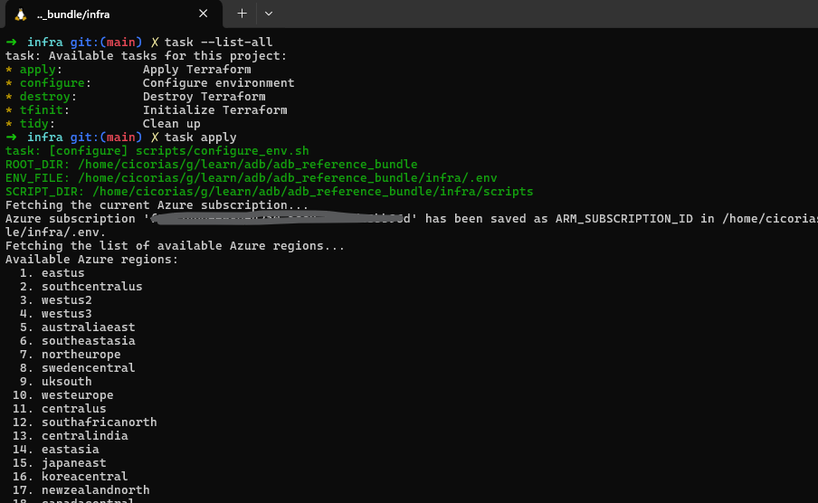
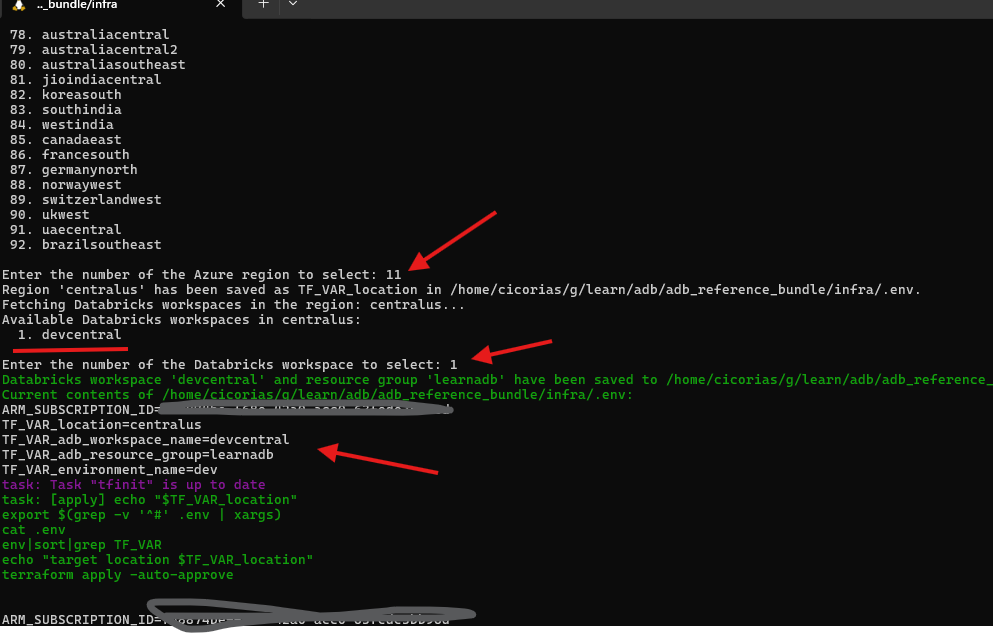
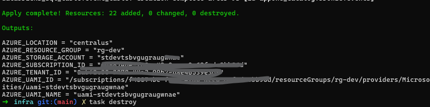
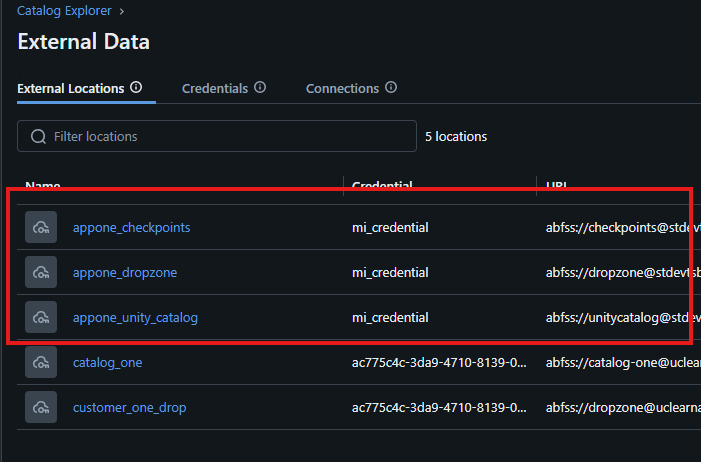
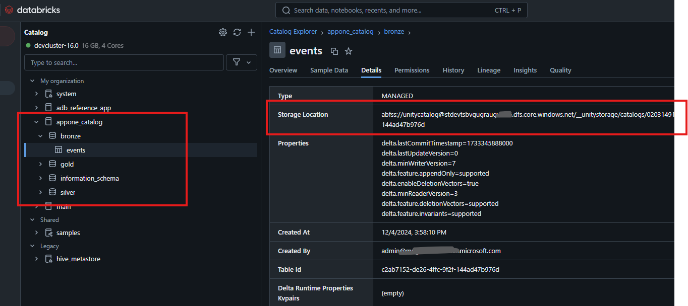
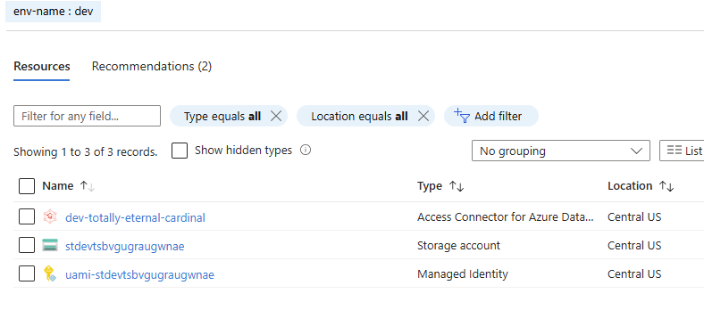
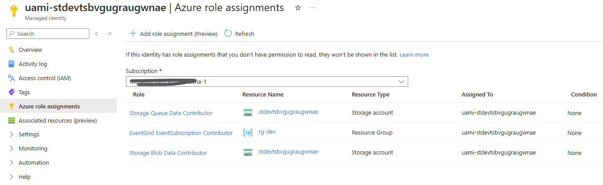

# Overview

Provides a walk-through for provisioning via Terraform an Azure Databricks Catalog for a workspace.

> [!IMPORTANT]  
>> This simple walkthrough assumes that a Azure Databricks Unity Catalog Metastore exists in the Azure Region that all work will be done.
>> Assumptions: ADB Workspace exists AND it is tied to a Regional Unity Catalog Metastore

## Terraform scripts

For the Terraform steps, there is a [Taskfile](https://taskfile.dev) that can be used to simplify.

## Requirements

1. Ensure you have an existing Azure Subscription, an Azure Databricks Workspace, and that Workspace is tied to a Unity Catalog for that Region.
1. You've installed the [Taskfile](https://taskfile.dev) tool - - [Taskfile.dev](https://taskfile.dev/installation/#binary)
1. Terraform CLI is installed - [Terraform v1.10](https://learn.hashicorp.com/tutorials/terraform/install-cli)

## Steps

1. Open a shell and change to the `./infra` path in the repo workspace.
1. Run `task --list-all` and you will see what tasks are available.
1. Run `task apply` to initially setup and create a `.env` file that has the settings needed for the Terraform scripts

### Configuration Script

The initial script using the Azure CLI login session first queries the list of Azure Regions for the current Azure Subscription. Then queries for Azure Databricks workspaces allowing a simple selection.

#### Region and Workspace Selection

#### Settings in `.env` file

#### Terraform Apply Done

## Azure Databricks Catalog, Schema, Table

At the end you will now have external locations for Catalog (databases), Dropzone, and Checkpoints (put your inferred schema here)

With a new Catalog in catalog explorer that has a Bronze, Silver, and Gold schema and an `event` table in the Bronze schema that showing the details we can see this is at our Azure ADLSv2 storage location.

## Azure Resources

In the Azure portal you can see the Resource Group with

- Access Connector for Azure Databricks
- Managed Identity - bound to the connector and RBAC assignments on the Storage Account
- Storage account

### Resource Group

### RBAC Assignments for Managed Identity

## Destroy 

> [!CAUTION]
> At this point, you can run the `task destroy` but be aware this destroys all data in the catalog just created.